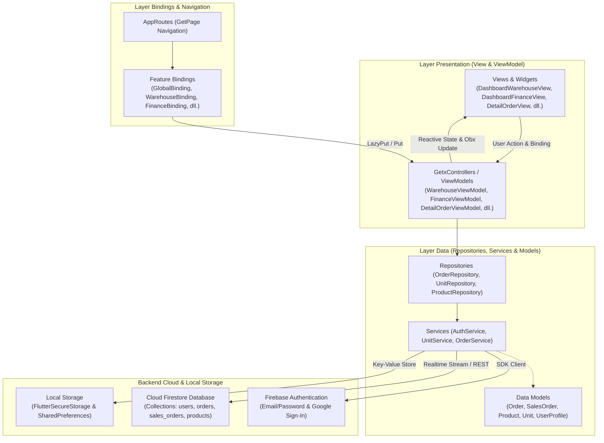
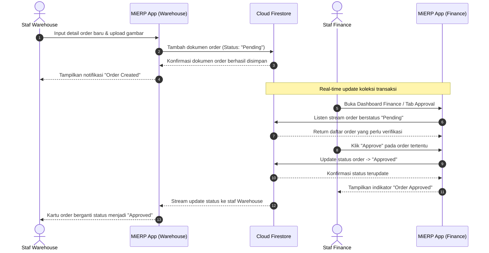

# 📦 MiERP (Mobile Integrated Enterprise Resource Planning)

<p align="center">
  
</p>

<p align="center">
  <strong>Integrated Mobile Enterprise Resource Planning & Inventory Management System</strong><br>
  <em>"Solusi Manajemen Operasional Bisnis, Inventaris, dan Finansial Terpadu Berbasis Mobile"</em>
</p>

<p align="center">
  
  
  
  
  
  
  
</p>

---

## 📖 Tentang MiERP

**MiERP (Mobile Integrated Enterprise Resource Planning)** adalah aplikasi mobile cerdas berbasis **Flutter** yang dirancang untuk mengintegrasikan dua pilar utama dalam ekosistem operasional bisnis: divisi **Warehouse (Gudang & Inventaris)** dan divisi **Finance (Keuangan & Approval Transaksi)**.

Aplikasi ini mengadopsi pola arsitektur **MVVM (Model-View-ViewModel)** dengan dukungan state management reaktif **GetX** serta backend cloud **Google Firebase (Firebase Authentication & Cloud Firestore)**. Dengan sistem terstruktur dan berbasis peran ganda (*Role-Based Access Control*), MiERP mengeliminasi birokrasi manual dan rekonsiliasi data yang memakan waktu, memastikan proses pencatatan stok, permohonan order barang, hingga persetujuan finansial berjalan cepat, akurat, dan transparan secara *real-time*.

---

## ✨ Fitur Utama Berdasarkan Peran (Role-Based Features)

### 👥 1. Sistem Multi-Role & Akses Terisolasi
- **Role Warehouse**: Dikhususkan bagi staf logistik/gudang untuk mengelola aset, stok, dan pembuatan purchase order / sales order.
- **Role Finance**: Dikhususkan bagi staf keuangan dan manajerial untuk meninjau, menyetujui (*approve*), atau menolak (*reject*) permohonan transaksi order.
- Tampilan antarmuka beranda (*Dashboard*), menu navigasi bawah, dan hak otorisasi disesuaikan secara otomatis berdasarkan profil akun yang aktif.

---

### 🏬 2. Modul Warehouse (Gudang & Inventaris)
- 📦 **Manajemen Stok Real-Time**:
  - Pemantauan volume ketersediaan stok produk dan status inventaris terkini.
  - Kartu ringkasan stok (*Card Stock Widget*) dengan visualisasi indikator stok aman dan menipis.
- ➕ **Pendaftaran Unit & Produk Baru**:
  - Formulir penambahan item barang ke katalog gudang.
  - Integrasi pemilihan foto produk menggunakan kamera atau galeri via **Image Picker**.
  - Pengelompokan unit satuan barang (*Add Unit*).
- 📋 **Pembuatan Purchase / Product Order**:
  - Pengajuan pesanan pembelian inventaris baru ke pihak supplier atau vendor.
- 🏷️ **Pembuatan Sales Order**:
  - Pencatatan transaksi pesanan penjualan produk ke pelanggan/klien bisnis.
- 🔍 **Detail Produk & Riwayat Order**:
  - Informasi spesifikasi produk, harga satuan, kategori, dan log perubahan transaksi.

---

### 💳 3. Modul Finance (Approval & Finansial)
- ✅ **Approval & Rejection Transaksi**:
  - Pemeriksaan rincian pesanan yang diajukan oleh staf Warehouse secara terperinci.
  - Otorisasi persetujuan (*Approve*) atau penolakan (*Reject*) pesanan secara satu klik.
- 💰 **Monitoring Arus Finansial**:
  - Pengawasan status pembayaran order (Pending, Approved, Rejected).
  - Tinjauan total nominal pembelanjaan inventaris dan perolehan penjualan produk.
- 📊 **Financial Summary**:
  - Rekapitulasi transaksi keuangan periodik untuk evaluasi kinerja operasional bisnis.

---

### 🔐 4. Autentikasi & Keamanan Sesi
- **Registrasi & Login**: Otentikasi aman menggunakan email & password via **Firebase Authentication**.
- **Google Sign-In**: Akses instan dengan akun Google yang terverifikasi.
- **Lupa Kata Sandi (Forgot Password)**: Mekanisme reset password otomatis terkirim ke email pengguna.
- **Penyimpanan Kredensial Aman**: Enkripsi token sesi dan status login lokal via **Flutter Secure Storage** dan **SharedPreferences**.

---

### 🔔 5. Fitur Pendukung
- **Pusat Notifikasi**: Notifikasi interaktif status pesanan dan persetujuan transaksi.
- **Profil Karyawan**: Informasi akun, divisi kerja, dan tombol keluar (*Logout*).
- **Onboarding & Splash Screen**: Pengalaman interaktif awal aplikasi dengan animasi **Lottie**.

---

## 🏗️ Arsitektur Sistem

Aplikasi MiERP dibangun menggunakan pola arsitektur **MVVM (Model-View-ViewModel)** yang dipadukan dengan konsep **Clean Architecture Data Layer** dan ekosistem **GetX**. Struktur ini memisahkan lapisan tampilan (*View*), logika bisnis (*ViewModel / GetxController*), dan komunikasi data (*Repositories & Services*).

### 1. Diagram Layer Arsitektur MVVM & GetX



### 2. Diagram Alir Approval Transaksi Order (End-to-End)

Diagram berikut mengilustrasikan alur transaksi dari pembuatan order oleh staf **Warehouse** hingga proses persetujuan oleh divisi **Finance**:



### 3. Penjelasan Layer Arsitektur

1. **Layer Presentation (`lib/features/[fitur]/presentation/`)**
   - **View**: Komponen antarmuka berbasis Flutter (`GetView<T>` atau `StatelessWidget`) yang menampilkan UI dan mengamati state secara reaktif (`Obx`). Bebas dari logika manipulasi data langsung.
   - **ViewModel (GetxController)**: Bertanggung jawab menangani logika bisnis, validasi input pengguna, mengelola state variabel reaktif (`RxString`, `RxBool`, `RxList`), dan berinteraksi dengan repository.
   - **Binding**: Menginisialisasi *Dependency Injection* untuk ViewModel terkait saat rute halaman dibuka (`Get.lazyPut()`).

2. **Layer Data (`lib/data/` & `lib/core/models/`)**
   - **Models**: Representasi objek data bisnis (misal: `Order`, `SalesOrder`, `Product`) yang dilengkapi metode serialisasi (`fromFirestore`, `toJson`, `toMap`).
   - **Repositories**: Lapisan abstraksi yang mengkoordinasikan data transaksi, menangani query Firestore, dan menyediakan interface bersih ke ViewModel.
   - **Services**: Pengelola koneksi pihak ketiga (Firebase Authentication, Cloud Firestore listener, Firebase Storage).

3. **Core & Global Configurations (`lib/core/` & `lib/bindings/`)**
   - **`core/routing/`**: Manajemen navigasi terpusat berbasis *Named Routes* (`AppRoutes.pages`).
   - **`core/themes/`**: Skema warna korporat, typography `GoogleFonts`, dan konfigurasi `ThemeData`.
   - **`core/widgets/`**: Komponen UI yang digunakan bersama (misalnya `CardOrder`, `CardSales`, `CardStock`, `ButtonProfileWidget`).
   - **`bindings/global_binding.dart`**: Inisialisasi controller global saat aplikasi pertama kali dijalankan.

---

## 🛠️ Teknologi & Dependensi

| Kategori | Teknologi / Pustaka | Deskripsi |
| :--- | :--- | :--- |
| **Framework** | [Flutter](https://flutter.dev) (SDK: `^3.10.1`) | Framework UI lintas platform modern |
| **Bahasa** | [Dart](https://dart.dev) | Bahasa pemrograman utama berorientasi objek |
| **State Management & DI** | [get](https://pub.dev/packages/get) (GetX `^4.7.3`) | Solusi all-in-one untuk state management, dependency injection, dan route management |
| **Otentikasi & Database Cloud** | [firebase_core](https://pub.dev/packages/firebase_core), [firebase_auth](https://pub.dev/packages/firebase_auth), [cloud_firestore](https://pub.dev/packages/cloud_firestore) | Layanan cloud backend terdistribusi dari Google Firebase |
| **Social Login** | [google_sign_in](https://pub.dev/packages/google_sign_in) | Otentikasi OAuth Google satu klik |
| **Penyimpanan Lokal** | [flutter_secure_storage](https://pub.dev/packages/flutter_secure_storage), [shared_preferences](https://pub.dev/packages/shared_preferences) | Penyimpanan sesi terenkripsi dan preferensi lokal |
| **Navigasi** | [persistent_bottom_nav_bar](https://pub.dev/packages/persistent_bottom_nav_bar) | Navigasi menu bawah dengan persistensi state antarmuka |
| **Media & Kamera** | [image_picker](https://pub.dev/packages/image_picker) | Pengambilan gambar produk langsung dari kamera atau galeri |
| **Responsivitas & Tipografi** | [flutter_screenutil](https://pub.dev/packages/flutter_screenutil), [google_fonts](https://pub.dev/packages/google_fonts) | Skala antarmuka adaptif dan custom font |
| **Desain & UI Components** | `chips_choice`, `dotted_border`, `dotted_line`, `modal_bottom_sheet`, `loading_animation_widget` | Pilihan chip interaktif, border dekoratif, modal sheet, dan animasi loading |
| **Animasi & Vektor** | [lottie](https://pub.dev/packages/lottie), [flutter_svg](https://pub.dev/packages/flutter_svg) | Animasi interaktif JSON dan rendering gambar vektor SVG |
| **Utilitas Waktu** | [intl](https://pub.dev/packages/intl) | Format mata uang rupiah, tanggal, dan waktu |

---

## 📂 Struktur Direktori Proyek

```text
lib/
├── bindings/                              # Global Dependency Injection Bindings
│   └── global_binding.dart
│
├── core/                                  # Komponen reusable & konfigurasi inti
│   ├── constants/                         # Konstanta aplikasi (warna, teks, key)
│   ├── models/                            # Data Transfer Object (Order, SalesOrder, dll.)
│   │   ├── order.dart
│   │   └── sales_order.dart
│   ├── routing/                           # Definisi rute navigasi aplikasi
│   │   ├── app_pages.dart
│   │   └── app_routes.dart
│   ├── themes/                            # Tema, warna, dan gaya tipografi
│   └── widgets/                           # Widget umum (CardOrder, CardSales, CardStock, dll.)
│       ├── button_profile_widget.dart
│       ├── card_order.dart
│       ├── card_sales.dart
│       └── card_stock.dart
│
├── data/                                  # Data Layer (Services & Repositories)
│   ├── auth/                              # Service otentikasi Firebase
│   └── warehouse/                         # Repositories & Services modul Warehouse
│       ├── add/                           # Add Unit, Product Order, Sales Order Repos
│       └── services/                      # Cloud Firestore Service Handlers
│
├── features/                              # Modul fitur aplikasi (MVVM)
│   ├── add/                               # Tambah Unit, Product Order, Sales Order
│   │   └── presentation/                  # View & ViewModel (Warehouse Add)
│   ├── dashboard/                         # Beranda Warehouse & Finance
│   │   └── presentation/                  # DashboardWarehouseView & DashboardFinanceView
│   ├── detail/                            # Detail Produk, Product Order, Sales Order
│   │   └── presentation/
│   ├── forgot_password/                   # Alur Lupa Kata Sandi
│   ├── loading/                           # Transisi Loading State
│   ├── login/                             # Halaman Masuk (Email & Google)
│   ├── main_page/                         # Root Shell Navigation (Finance & Warehouse)
│   ├── notification/                      # Pusat Notifikasi Transaksi
│   ├── onboarding/                        # Layar Pengenalan Aplikasi
│   ├── profile/                           # Manajemen Akun & Pengaturan Profil
│   ├── register/                          # Pendaftaran Akun Karyawan Baru
│   ├── splash/                            # Layar Pembuka & Pemeriksaan Sesi
│   └── summary/                           # Ringkasan Transaksi & Statistik Finansial
│
├── firebase_options.dart                  # Konfigurasi Firebase CLI
└── main.dart                              # Titik awal masuk aplikasi (Main Entry Point)
```

---

## 🚀 Memulai (Getting Started)

### Prasyarat
Pastikan komputer Anda telah terpasang perangkat lunak berikut:
- [Flutter SDK](https://docs.flutter.dev/get-started/install) (versi `^3.10.1` atau lebih baru)
- [Dart SDK](https://dart.dev/get-dart)
- Editor yang didukung: VS Code atau Android Studio dengan plugin Flutter & Dart
- Perangkat Android fisik atau Emulator dengan Google Play Services aktif (untuk pengujian Firebase)

### Langkah Instalasi

1. **Clone repositori**:
   ```bash
   git clone https://github.com/neusid/mierp.git
   cd mierp
   ```

2. **Pasang dependensi pustaka**:
   ```bash
   flutter pub get
   ```

3. **Konfigurasi Firebase**:
   - Pastikan file `google-services.json` diletakkan pada folder `android/app/`.
   - Pastikan file `GoogleService-Info.plist` diletakkan pada folder `ios/Runner/` (jika membangun untuk iOS).
   - Atau gunakan FlutterFire CLI untuk mengonfigurasi ulang:
     ```bash
     flutterfire configure
     ```

4. **Jalankan aplikasi**:
   ```bash
   flutter run
   ```

---

## 📱 Alur Penggunaan (Role-Based Workflow)

### 🏬 Alur Staf Warehouse:
1. **Login**: Masuk menggunakan akun terdaftar dengan peran Warehouse.
2. **Dashboard Warehouse**: Pantau status ketersediaan stok produk dan transaksi aktif.
3. **Tambah Unit/Produk**: Daftarkan produk baru lengkap dengan gambar, nama unit, dan kategori.
4. **Buat Order**: Ajukan pesanan produk atau pesanan penjualan baru. Status pesanan akan otomatis menjadi *Pending*.
5. **Monitoring**: Tunggu konfirmasi approval dari divisi Finance melalui status pesanan.

### 💳 Alur Staf Finance:
1. **Login**: Masuk menggunakan akun terdaftar dengan peran Finance.
2. **Dashboard Finance**: Tinjau statistik finansial dan daftar antrean order yang memerlukan persetujuan.
3. **Review Transaksi**: Buka rincian pesanan (*Detail Product Order* atau *Detail Sales Order*).
4. **Otorisasi**: Tekan tombol **Approve** untuk menyetujui transaksi atau **Reject** untuk menolak.
5. **Laporan & Summary**: Tinjau akumulasi transaksi di menu *Summary* untuk evaluasi bisnis.

---

## 📄 Lisensi & Hak Cipta

Dikelola dan dikembangkan untuk operasional **MiERP**. Seluruh hak cipta dilindungi undang-undang.

